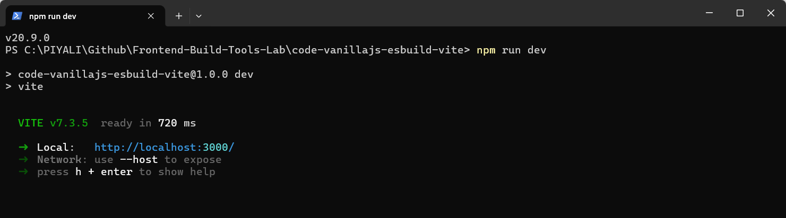
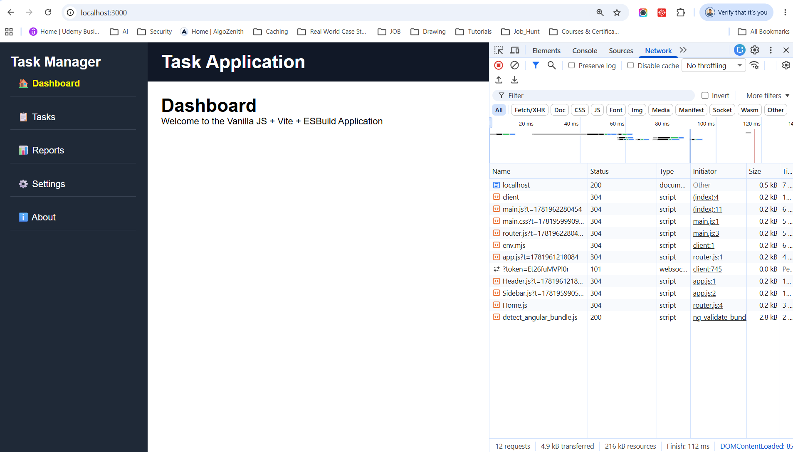
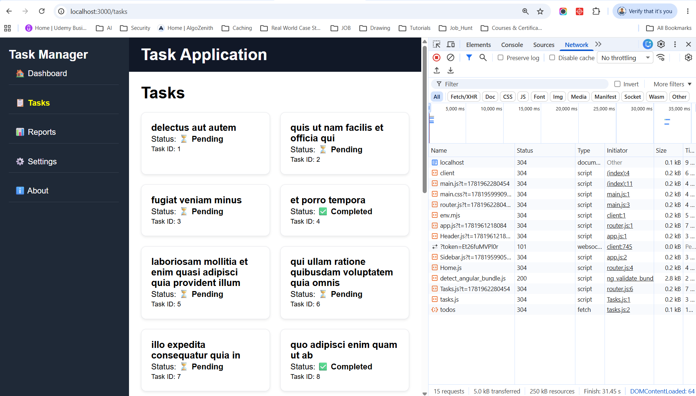
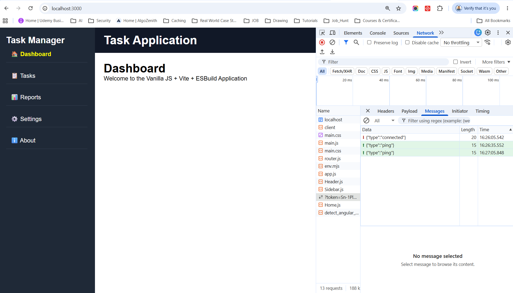
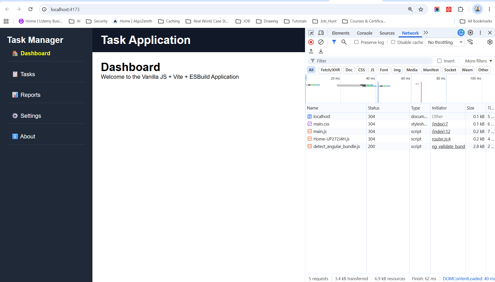

# Vanilla JavaScript + Vite + ESBuild
a custom application that uses Vanilla JavaScript + Vite + ESBuild together.

**Why use Vite + ESBuild together?**

Vite already uses ESBuild internally for very fast dependency pre-bundling and TypeScript/JS transpilation. However, in larger organizations it's common to:
- Use Vite for local development and HMR.
- Use a custom ESBuild pipeline for production builds.
- Add custom plugins, bundle analysis, microfrontend packaging, or CI/CD optimizations.

This demonstrates hands-on frontend tooling experience because we're controlling both the developer experience (Vite) and the build pipeline (ESBuild) rather than relying entirely on framework defaults.

# Run
Vite uses port 5173 for its development server and 4173 for its preview server by default. The preview server serves the production build output (dist) and allows developers to validate the production bundle locally before deployment. These ports are arbitrary defaults chosen by Vite and can be customized in vite.config.js or via command-line options.

install dependencies
```
npm i
```

**Start Development Server (Vite HMR)**
```
npm run dev
```
You should see output similar to:
```
VITE v7.x ready in 200ms

➜ Local:   http://localhost:3000/
➜ Network: use --host to expose
```
Vite default dev server port is 5173. but i have configured port 3000 in vite.config.js.



Open:
```
http://localhost:3000
```


Click on Tasks link of left sidebar



Vite uses WebSockets during development for Hot Module Replacement (HMR).     



**Production Build (ESBuild)**
```
npm run build
```
Expected:
```
Build Complete
``
Generated:
``
dist/
 ├── main.js
 ├── main.css
 └── ...
```

**Vite Preview**
Run:
```
npm run build
```
run preview
```
npm run preview
```
Then open:
```
http://localhost:4173
```


> localhost:4173 is the default preview port chosen by Vite.

**Vite uses different ports for different purposes:**
| Command                             | Purpose                  | Default Port |
| ----------------------------------- | ------------------------ | ------------ |
| `vite` or `npm run dev`             | Development server       | **5173**     |
| `vite preview` or `npm run preview` | Preview production build | **4173**     |


## Vite Development vs Preview

**Development**
```
npm run dev
```
Starts:
```
http://localhost:3000
```
Features:
- HMR (Hot Module Replacement)
- WebSocket connection
- Fast refresh
- Source maps

with Vite:
```
Browser
   │
   ▼
Vite Dev Server
   │
   ▼
WebSocket
```
Vite also opens a WebSocket connection for HMR.


Vite starts:
```
HTTP server (serving your app)
WebSocket connection (for live updates)
```
The browser connects to something like:
```
http://localhost:3000
ws://localhost:3000
```
or
```
wss://localhost:3000
```

(if HTTPS is enabled).


**Preview**
```
npm run preview
```
Starts:
```
http://localhost:4173
```
Features:
- Serves the built dist folder
- Simulates production
- No HMR
- No development transforms

You can run:
```
vite preview --port 3000
```
or in package.json:
```
{
  "scripts": {
    "preview": "vite preview --port 3000"
  }
}
```
Then:
```
http://localhost:3000
```

## Why Vite uses WebSockets

Without refreshing the page, Vite can:
```
Update CSS instantly
Reload changed JavaScript modules
Show build errors in the browser
Preserve application state where possible
```

Example flow:
```
Developer saves file
        ↓
     Vite
        ↓
 WebSocket Message
        ↓
     Browser
        ↓
Replace updated module
```

**How Vite Uses WebSockets**
- The Connection: When you open your application in a browser, a built-in Vite client script establishes a persistent WebSocket connection (ws:// or wss://) back to the Vite dev server.
- File Watching: The server constantly monitors your source files for changes.
- Push Notification: The moment you save an edit, Vite computes the change and pushes a lightweight JSON payload over the open WebSocket to the browser.

## HMR vs. Live Reloading
The WebSocket payload tells the browser client exactly how to handle the update depending on what changed:
- Hot Module Replacement (HMR): If the modified code is within a module that supports hot swapping (like a Vue, Svelte, or React component), the WebSocket message sends the path of the updated file. The Vite client then dynamically re-imports only that module using native ES Modules (import()), swapping out the code in milliseconds without losing your application's current state.
- Live Reloading (Full Reload): If you change a file that does not have an active HMR boundary handler (like a raw configuration file or a generic HTML template), Vite handles it via a fallback. The WebSocket server sends a full-reload instruction, and the Vite client forces a standard browser refresh (location.reload())

## Send Real-Time Events from Browser to Vite Dev Server
import.meta.hot.send() is part of Vite's HMR API and allows a client module to send custom events to the Vite dev server during development. 
To send real-time events from the browser to the Vite Dev Server, use the built-in HMR WebSocket channel.


**Important Limitation**

import.meta.hot.send() only works when:
```
npm run dev
```
because it uses Vite's development WebSocket. After:
```
npm run build
npm run preview
```
or in production behind Nginx/Node.js, import.meta.hot is removed and the API no longer exists.

For production real-time communication, use:
- Native WebSocket
- Socket.IO
- Server-Sent Events (SSE)
- SignalR
- WebTransport

instead of import.meta.hot.send().

**Bidirectional Real-Time Communication**
```
┌───────────────┐
│    Browser    │
└───────┬───────┘
        │
        │ import.meta.hot.send()
        ▼
┌────────────────────┐
│ Vite WebSocket     │
│ Dev Server         │
└─────────┬──────────┘
          │
          │ server.ws.on()
          ▼
     Custom Logic
          │
          │ server.ws.send()
          ▼
┌───────────────┐
│    Browser    │
└───────────────┘
```

## Vite Port Configure Permanently

In vite.config.js:
```
import { defineConfig } from 'vite';

export default defineConfig({
  server: {
    port: 5173
  },

  preview: {
    port: 4173
  }
});
```
Or customize:
```
export default defineConfig({
  server: {
    port: 3000
  },

  preview: {
    port: 8080
  }
});
```

## Flow
```
┌───────────────────────┐
│      Browser          │
└──────────┬────────────┘
           │
           ▼
┌───────────────────────┐
│   Vanilla JavaScript  │
│  Application Code     │
└──────────┬────────────┘
           │
           ▼
┌───────────────────────┐
│        Vite           │
│ Dev Server + HMR      │
│ Asset Processing      │
└──────────┬────────────┘
           │
           ▼
┌───────────────────────┐
│      ESBuild          │
│ Fast Transpilation    │
│ Bundling/Minification │
└───────────────────────┘
```

## Project Features

Task Management Dashboard

✓ Vanilla JS Components    
✓ Client-side Routing      
✓ State Management     
✓ API Layer    
✓ Vite Dev Server      
✓ ESBuild Production Bundle    
✓ Lazy Loading     
✓ Environment Variables        
✓ Local Storage Persistence        
