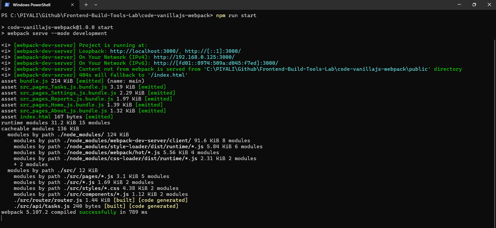
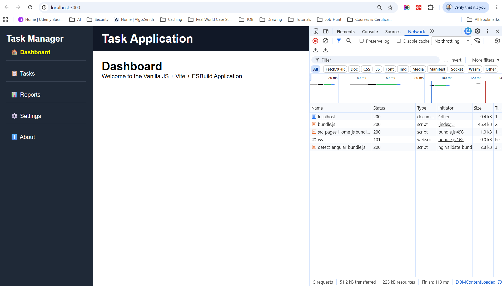
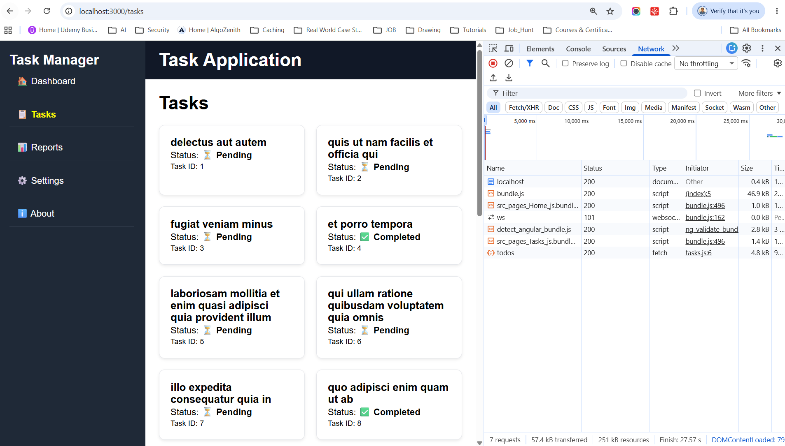
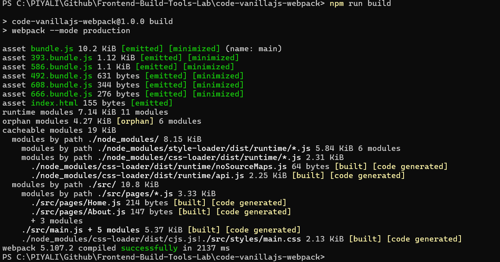
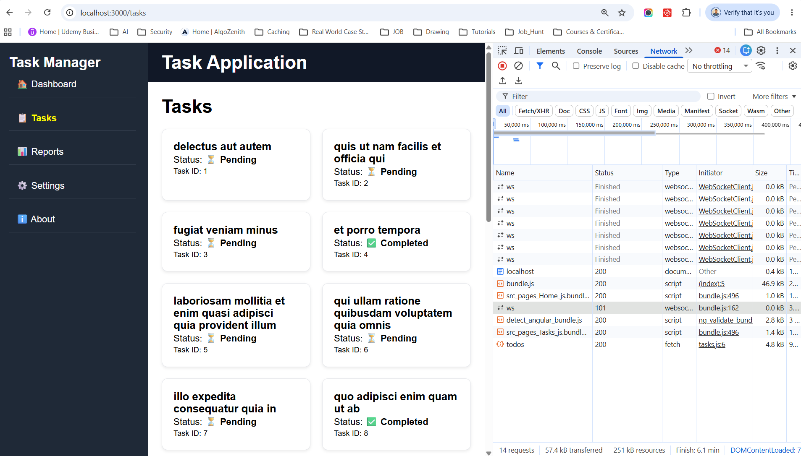
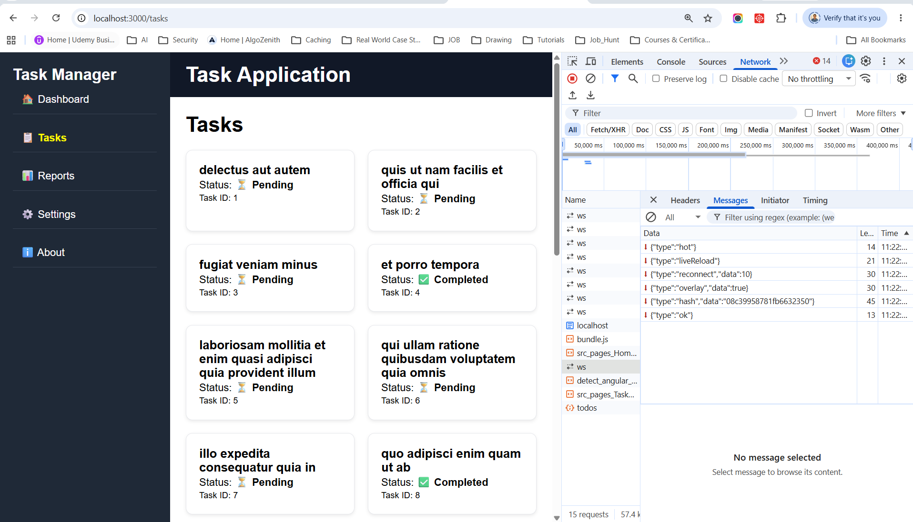

# Vanilla JavaScript + Weebpack
a custom application that uses Vanilla JavaScript + Webpack together.

This demonstrates hands-on frontend tooling experience because we're controlling both the development server run & production build using Webpack with custom configuration.

# Run

install dependencies
```
npm i
```

**Development:**
```
npm run start
```
Output:
```
webpack compiled successfully
```


Browser runs:
```
http://localhost:3000
```


Click on Tasks link of left sidebar




**Production:**
```
npm run build
```
Generated:
```
dist/
├── index.html 
└── bundle.js
```


## What Happens in Production?

When you run:
```
npm run build
```
Webpack generates:
```
dist/
 ├── index.html
 └── bundle.js
```
and the WebSocket code disappears.

Production:
```
Browser
   │
   ▼
Static Files
   │
   ▼
API Server
```
No webpack-dev-server.      
No HMR.     
No WebSocket (unless your application explicitly uses one).     

## What Happens in Dev? Why Websocket is called with Webpack application ?




What you're seeing is completely normal for Webpack Dev Server.

**The WebSocket connections are not from your application API. They are created by webpack-dev-server for Hot Module Replacement (HMR) and live reloading.**

> Webpack Dev Server uses a WebSocket connection to enable Hot Module Replacement and live reloading. The browser maintains a persistent connection to the development server, which pushes notifications when source files change. These WebSockets are development-only and are not included in the production build unless the application explicitly implements WebSocket functionality.

From your screenshot:
```
ws   101   websocket   WebSocketClient
```
The clues are:
```
Initiator: WebSocketClient
Status: 101 Switching Protocols
```
This indicates Webpack's development tooling.

**When you run:**
```
npm start
```
Webpack starts:
```
webpack-dev-server
```
Architecture:
```
Browser
   │
   │ WebSocket
   ▼
Webpack Dev Server
   │
   ▼
Source Files
```
The browser keeps a persistent connection open so Webpack can notify it when files change.


**Example Flow**

You edit:
```
src/pages/Tasks.js
```
Webpack detects:
```
File Changed
```
and sends a WebSocket message:
```
{
  "type": "hash",
  "data": "new-build-id"
}
```
Browser receives:
```
Update Available
```
and reloads only the affected module.

**Without WebSocket**
```
Developer changes file
      │
      ▼
Manual Refresh (F5)
      │
      ▼
Browser reloads
```

**With WebSocket (HMR)**
```
Developer changes file
      │
      ▼
Webpack rebuilds
      │
      ▼
WebSocket message
      │
      ▼
Browser updates automatically
```

**Why Status = 101?**

WebSocket starts as HTTP:
```
GET /ws
Upgrade: websocket
```
Server responds:
```
101 Switching Protocols
```
Meaning:
```
HTTP → WebSocket
```
This is expected.


## Traditional Webpack Build
```
Source Code
     │
     ▼
 Babel
 (Transpile)
     │
     ▼
 Webpack
 (Bundle)
     │
     ▼
 Browser
```

## Vite vs Webpack
| Feature                   | Vite      | Webpack     |
| ------------------------- | --------- | ----------- |
| Startup Speed             | Very Fast | Slower      |
| HMR                       | Very Fast | Good        |
| Configuration             | Minimal   | Extensive   |
| Plugin Ecosystem          | Growing   | Huge        |
| Enterprise Legacy Apps    | Medium    | Very Common |
| Angular/React/Vue Support | Excellent | Excellent   |
| Learning Curve            | Easier    | Higher      |
| Bundle Control            | Good      | Excellent   |
| Module Federation         | Limited   | Excellent   |


## Project Features

Task Management Dashboard

✓ Vanilla JS Components    
✓ Client-side Routing      
✓ State Management     
✓ API Layer    
✓ Vite Dev Server      
✓ ESBuild Production Bundle    
✓ Lazy Loading     
✓ Environment Variables        
✓ Local Storage Persistence        

## Folder Structure
```
my-app/

├── src/
│   ├── api/
│   │   └── tasks.js
│   │
│   ├── components/
│   │   ├── Header.js
│   │   ├── TaskCard.js
│   │   └── Sidebar.js
│   │
│   ├── pages/
│   │   ├── Home.js
│   │   ├── About.js
│   │   ├── Reports.js
│   │   ├── Settings.js
│   │   └── Tasks.js
│   │
│   ├── store/
│   │   └── store.js
│   │
│   ├── router/
│   │   └── router.js
│   │
│   ├── styles/
│   │   └── main.css
│   │
│   ├── main.js
│   └── app.js
│
├── build.js
├── vite.config.js
├── package.json
└── index.html
```

This gives you a complete multi-page Vanilla JS SPA with:
- Dashboard/Home page
- Tasks page
- Reports page
- Settings page
- Sidebar navigation
- Dynamic routing
- LocalStorage persistence
- Vite development server
- ESBuild production build pipeline

similar to the architecture often used when demonstrating frontend tooling expertise with Vite and ESBuild.